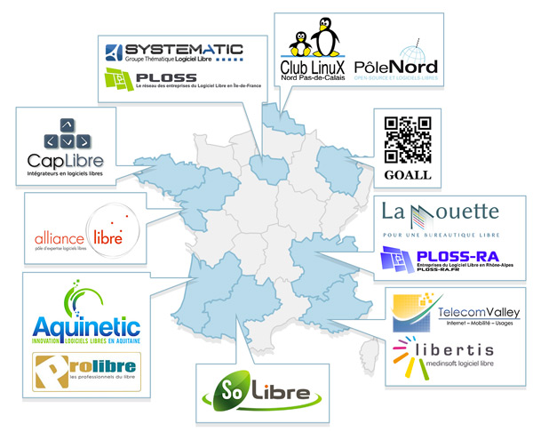

title: Rencontres Régionales du Logiciel Libre et du Secteur Public
date: 2013/06/13
image: rrletsp2.jpg

## Le Conseil National du Logiciel Libre et ses représentants régionaux présentent
+ Une série d’événements pour LE SECTEUR PUBLIC et LES COLLECTIVITES, ses DSI et ses ELUS
+ Organisés dans TOUTE LA FRANCE
+ Pour découvrir les BENEFICES des SOLUTIONS TIC LIBRES ET OPEN SOURCE sur les USAGES et l’ÉCONOMIE RÉGIONALE
+ Avec des _RETOURS D'EXPERIENCES_ de collectivités

## A qui s'adresse-t-il ?
+ Vous DSI... "Répondez à vos enjeux de productivité grâce à des solutions interopérables et assurant un ROI rapide"
+ Vous ELUS... "Favorisez l'emploi dans votre région en confiant vos prestations TIC à des entreprises locales"
+ Et vous... qui ne connaissez pas encore les atouts des solutions TIC libres/OS et leur écosystème régional.

## Pourquoi venir ?
### Découvrir un modèle différenciant qui offre :
+ Des coûts avantageux car axés sur le service et non la licence d'utilisation ;
+ Le respect des standards avec un modèle d'innovation ouverte pour des solutions interopérables au sein de votre SI ;
+ De la pérennité avec un écosystème riche de prestataires professionnels spécialisés dans les solutions ;
+ Une palette de services apte à répondre à tous vos besoins métier.

### Rencontrez vos pairs avec des problématiques communes !

### Rencontrez les prestataires locaux de l'Open Source !

## Le planning des rencontres régionales

